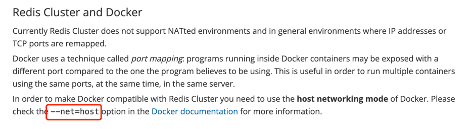
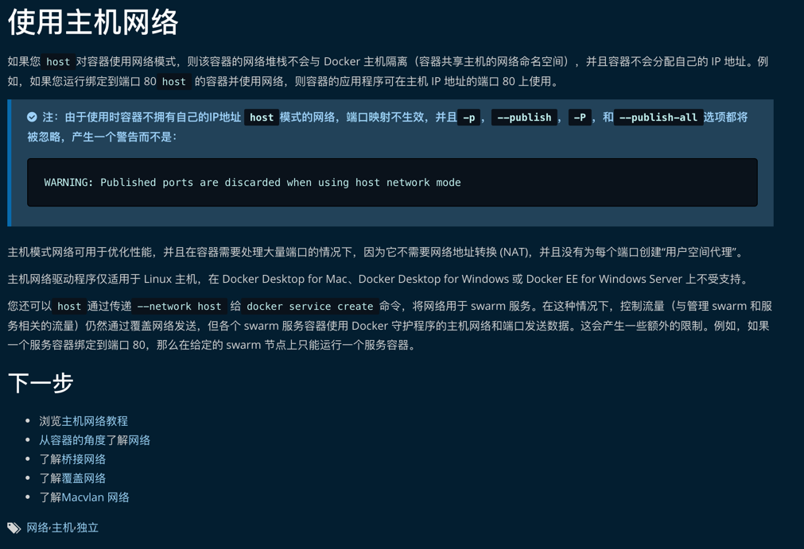

1.因docker容器的网络问题，若容器A部署项目，容器B部署redis，想容器互联的化
  可以尝试使用"主机网络模式"

//使用主机网络（--network host）

    redis容器
    docker run -d --network host \
    -v /usr/redis6379/conf/redis.conf:/usr/local/etc/redis/redis.conf \
    -v /usr/redis6379/datadir:/data \
    -v /usr/redis6379/logs:/var/log/redis/ \
    --name redis_6379_network_host redis:latest \
    redis-server /usr/local/etc/redis/redis.conf

    项目容器    
    docker run -d --network host --name image_rear_network_host image_rear:2.0 

redis官方的相关说明
https://redis.io/topics/cluster-tutorial

    Redis Cluster and Docker
    Currently Redis Cluster does not support NATted environments 
    and in general environments where IP addresses or TCP ports are remapped.
    
    Docker uses a technique called port mapping: programs running inside Docker containers 
    may be exposed with a different port compared to the one the program believes to be using. 
    This is useful in order to run multiple containers using the same ports, at the same time, in the same server.
    
    In order to make Docker compatible with Redis Cluster you need 
    to use the host networking mode of Docker. 
    Please check the --net=host option in the Docker documentation for more information.

docker官方的相关说明

